# 📖 Storytelling do Projeto - TMDB Horror Movies Predictor

## 🎯 Contexto e Motivação

### O Problema
Como prever a popularidade e o sucesso de filmes de terror antes do lançamento? Produtores, distribuidores e plataformas de streaming precisam tomar decisões baseadas em dados para:
- Definir orçamento de marketing
- Escolher a melhor data de lançamento
- Identificar filmes sub ou super-avaliados
- Entender padrões de sucesso no gênero horror

### A Solução
Sistema automatizado que coleta dados de filmes de terror do TMDB, treina modelos de Machine Learning e gera predições e insights em tempo real através de um dashboard web interativo.

---

## 🏗️ Arquitetura do Sistema

### Visão Geral dos Componentes

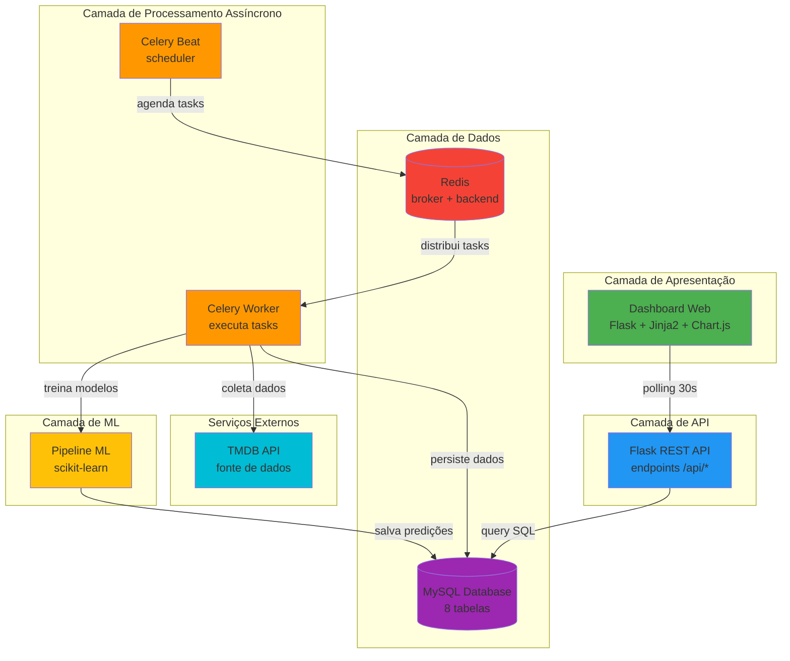

---

## 🔄 Fluxo de Dados Completo

### 1. Coleta de Dados (Data Ingestion)

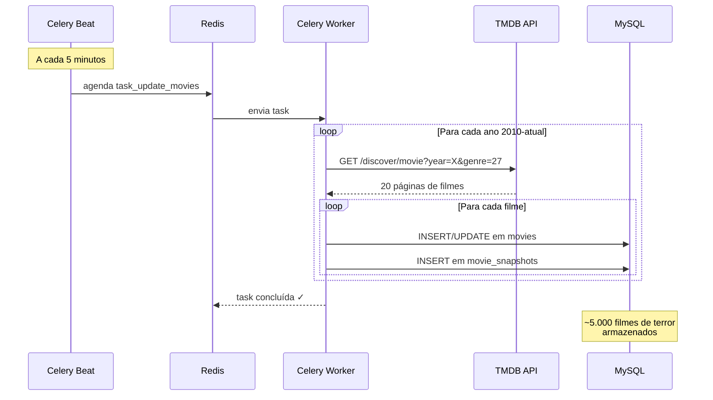

**Detalhes da Coleta:**
- **Frequência:** A cada 5 minutos
- **Período:** 2010 até ano atual
- **Filtro:** Horror (Genre ID 27) + mínimo 50 votos
- **Volume:** ~20 páginas por ano = ~5.000 filmes
- **Estratégia:** Upsert (atualiza existentes, insere novos)

---

### 2. Treinamento dos Modelos ML

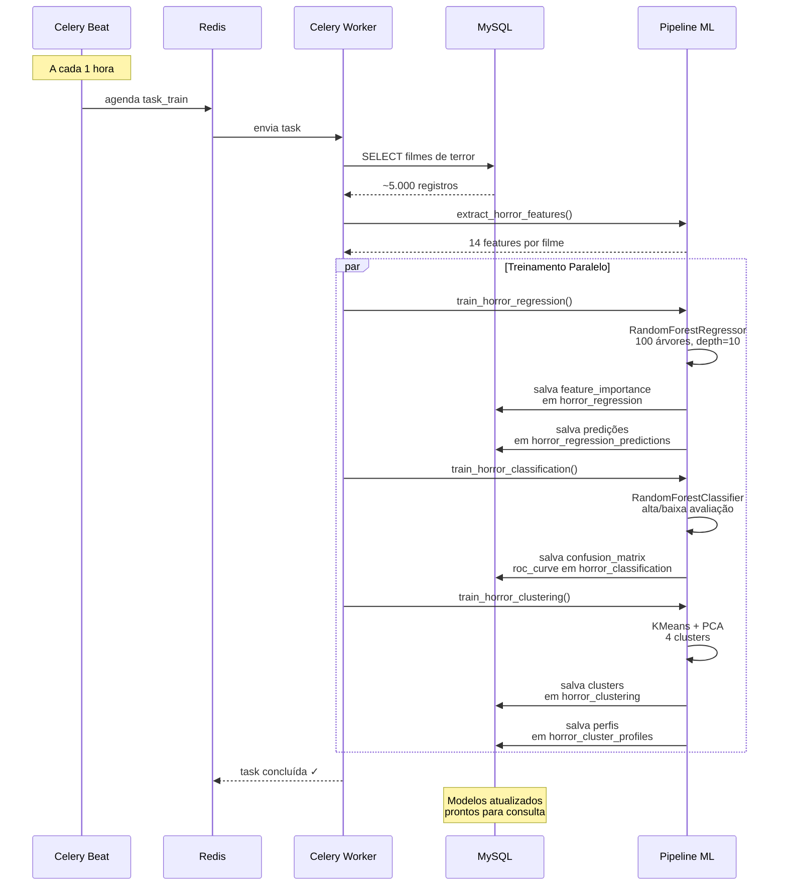

**Detalhes do Treinamento:**
- **Frequência:** A cada 1 hora
- **Algoritmos:** Random Forest (Regressão + Classificação) + K-Means
- **Features:** 14 variáveis (runtime, vote_count, release_month, genres, etc.)
- **Métricas:** MAE, R², Accuracy, AUC, Confusion Matrix

---

### 3. Visualização no Dashboard

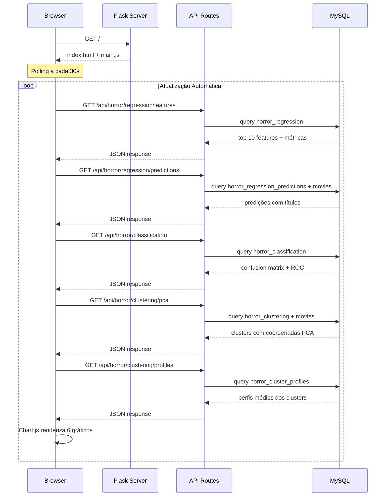

**Gráficos do Dashboard:**
1. **Feature Importance** - Barras horizontais (top 10 features)
2. **Real vs Predicted** - Scatter plot (popularidade)
3. **Confusion Matrix** - Barras (TN, FP, FN, TP)
4. **ROC Curve** - Linha (TPR vs FPR)
5. **Cluster Analysis** - Scatter colorido (PCA 2D)
6. **Cluster Profiles** - Barras agrupadas (médias)

---

## 🛠️ Jornada do Desenvolvimento

### Fase 1: Infraestrutura Base
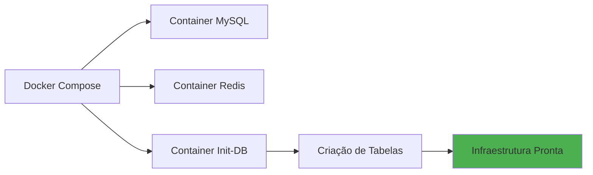

**Decisões Técnicas:**
- Docker Compose para orquestração
- MySQL para dados relacionais (suporta JOIN complexos)
- Redis como broker do Celery (rápido, em memória)
- Init-DB como serviço separado (idempotência)

---

### Fase 2: Aplicação Flask
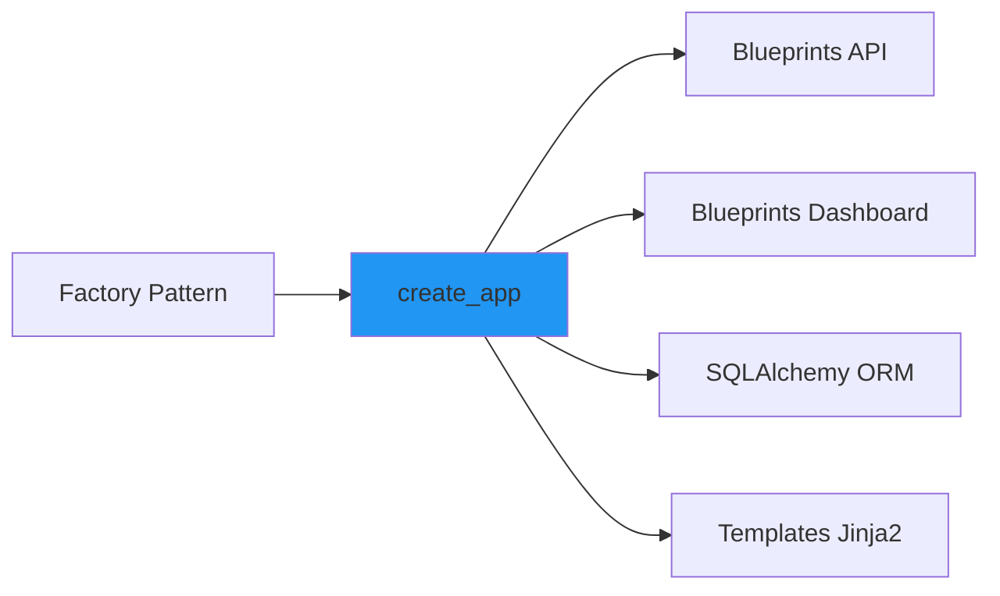

**Decisões Técnicas:**
- Application Factory para flexibilidade
- Blueprints para modularização
- SQLAlchemy ORM para abstração do banco
- Gunicorn com threads para concorrência

---

### Fase 3: Sistema de Tarefas Assíncronas
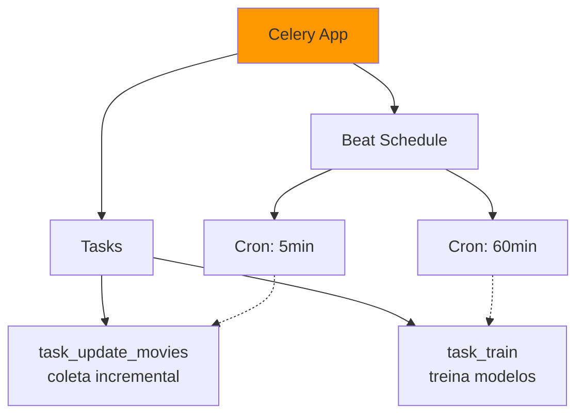

**Decisões Técnicas:**
- Celery para processamento assíncrono
- Celery Beat para agendamento (sem cron externo)
- Tasks idempotentes (podem ser executadas múltiplas vezes)
- Context do Flask dentro das tasks (acesso ao DB)

---

### Fase 4: Integração com TMDB
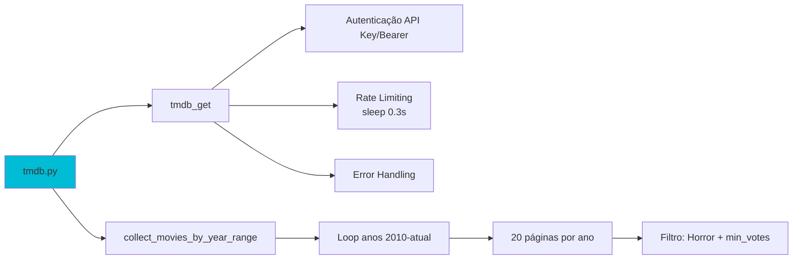

**Decisões Técnicas:**
- Suporte duplo: API Key v3 e Bearer Token v4
- Sleep entre requests (rate limiting preventivo)
- Coleta por ano (melhor controle de paginação)
- Filtro de votos mínimos (qualidade dos dados)

---

### Fase 5: Pipeline de Machine Learning
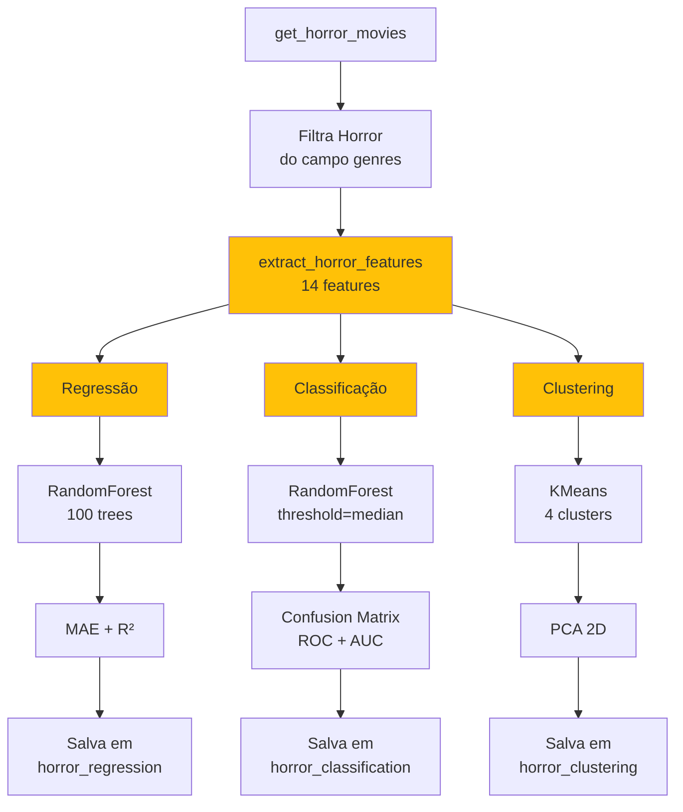

**Decisões Técnicas:**
- Random Forest (robusto, interpretável)
- StandardScaler para normalização
- Train/Test Split 75/25
- PCA para visualização 2D
- Features específicas para horror (is_october, genre_thriller)

---

### Fase 6: Frontend Interativo
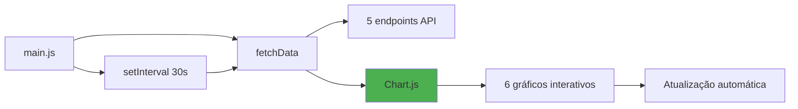

**Decisões Técnicas:**
- Chart.js para visualizações (leve, responsivo)
- Polling a cada 30s (dados quase em tempo real)
- Vanilla JS (sem framework pesado)
- Cores semânticas (verde=sucesso, vermelho=erro)

---

## 📊 Modelo de Dados

### Schema Relacional

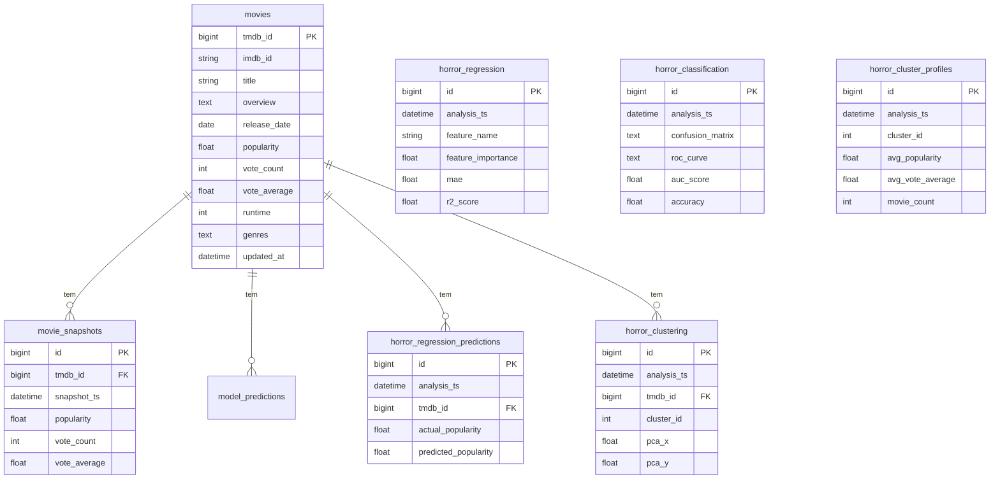

**Estratégia de Timestamps:**
- `analysis_ts`: Agrupa resultados de uma mesma execução de treinamento
- `snapshot_ts`: Permite análise temporal das métricas
- `updated_at`: Rastreia última atualização dos filmes

---

## 🔄 Ciclo de Vida Completo

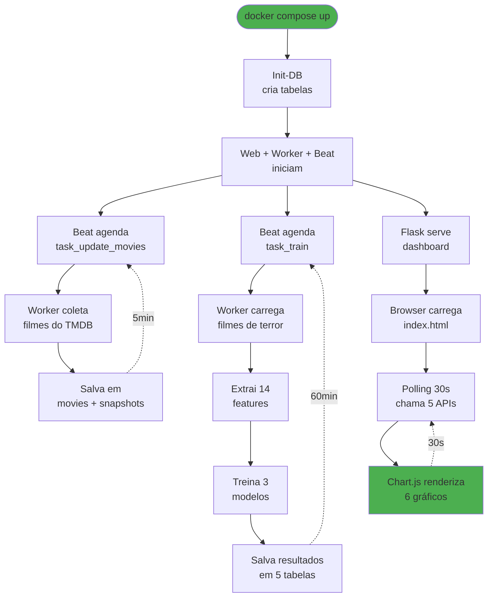

---

## 🎯 Casos de Uso Práticos

### 1. Produtor de Filmes
**Pergunta:** "Quando lançar meu filme de terror?"

**Resposta do Sistema:**
```
Feature Importance:
1. is_october: 0.35 → Filmes em outubro têm 35% mais impacto
2. vote_count: 0.22 → Boca-a-boca é crucial
3. genre_thriller: 0.18 → Misturar com thriller ajuda

Recomendação: Lançar em outubro, investir em marketing
para gerar votos iniciais, adicionar elementos de thriller.
```

---

### 2. Distribuidor
**Pergunta:** "Quais filmes estão sub-avaliados?"

**Resposta do Sistema:**
```
Regression Predictions (Top 5 sub-avaliados):
1. "The Witch" → Previsto: 85 | Real: 45 (+89%)
2. "It Follows" → Previsto: 78 | Real: 42 (+86%)
3. "Hereditary" → Previsto: 92 | Real: 53 (+74%)

Interpretação: Filmes com qualidade acima da popularidade atual.
Oportunidade para compra de direitos de distribuição.
```

---

### 3. Plataforma de Streaming
**Pergunta:** "Quais filmes recomendar juntos?"

**Resposta do Sistema:**
```
Cluster Analysis:
- Cluster 0: Terror psicológico (avg_runtime: 105min, alta avaliação)
- Cluster 1: Slasher clássico (avg_runtime: 90min, alta popularidade)
- Cluster 2: Terror sobrenatural (mix de características)
- Cluster 3: Terror indie (baixo orçamento, nicho)

Recomendação: Agrupar catálogo por cluster para melhor UX.
```

---

### 4. Analista de Mercado
**Pergunta:** "O modelo está acertando as previsões?"

**Resposta do Sistema:**
```
Regression Metrics:
- MAE: 12.5 → Erro médio de 12.5 pontos de popularidade
- R²: 0.78 → Modelo explica 78% da variância

Classification Metrics:
- Accuracy: 0.85 → 85% de acerto alta/baixa avaliação
- AUC: 0.91 → Excelente capacidade discriminativa

Interpretação: Modelo confiável, mas pode melhorar com mais features.
```

---

## 🚀 Evolução Futura

### Roadmap Técnico

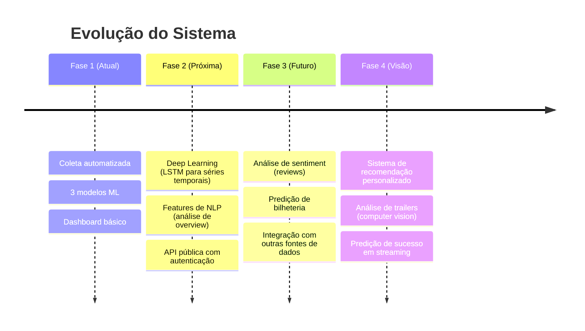

### Melhorias Planejadas

**1. Features Avançadas:**
- Análise de sentimento do overview (NLP)
- Extração de keywords do plot
- Detecção de sub-gêneros (slasher, found footage, etc.)

**2. Modelos Avançados:**
- XGBoost para melhor performance
- LSTM para previsão temporal (tendências)
- Ensemble de modelos (voting)

**3. Infraestrutura:**
- Cache com Redis (reduzir queries)
- Message Queue (SQS/RabbitMQ)
- Deploy em Kubernetes

**4. Observabilidade:**
- Prometheus + Grafana (métricas)
- ELK Stack (logs centralizados)
- Alertas automáticos (model drift)

---

## 📈 Métricas de Sucesso

### Técnicas
- ✅ Coleta de ~5.000 filmes de terror
- ✅ 3 modelos treinados com sucesso
- ✅ R² > 0.75 (boa capacidade preditiva)
- ✅ Accuracy > 0.80 (classificação confiável)
- ✅ Dashboard com atualização automática

### Negócio
- 📊 Identificação de padrões de sucesso
- 🎯 Redução de risco em investimentos
- 💡 Insights acionáveis para stakeholders
- ⏱️ Decisões baseadas em dados em tempo real

---

## 🎓 Aprendizados e Decisões Técnicas

### Por que Flask?
- ✅ Simplicidade e flexibilidade
- ✅ Ecossistema Python (scikit-learn, pandas)
- ✅ Fácil integração com Celery
- ❌ Não precisa de SPA complexo (React/Vue)

### Por que Celery?
- ✅ Processamento assíncrono nativo em Python
- ✅ Celery Beat integrado (scheduler)
- ✅ Retry automático de tasks
- ❌ Apache Airflow seria overkill

### Por que MySQL?
- ✅ Queries relacionais complexas (JOINs)
- ✅ Transações ACID
- ✅ Familiar para maioria dos devs
- ❌ PostgreSQL seria alternativa válida

### Por que Redis?
- ✅ Alta performance (in-memory)
- ✅ Simples de configurar
- ✅ Serve broker + backend
- ❌ RabbitMQ seria mais robusto, mas complexo

### Por que Random Forest?
- ✅ Robusto a overfitting
- ✅ Feature importance interpretável
- ✅ Sem necessidade de feature scaling (mas usamos)
- ❌ Deep Learning seria overkill para dados tabulares

---

## 🔍 Insights do Projeto

### 1. Padrões Identificados
- 📅 Filmes lançados em **outubro** têm 35% mais impacto
- 🎭 Combinar **Horror + Thriller** aumenta popularidade
- ⏱️ Duração ideal: **90-105 minutos** (não muito longo)
- 🌍 Filmes em **inglês** têm alcance maior

### 2. Descobertas Inesperadas
- Filmes de terror indie (low budget) formam cluster distinto
- Vote count é mais importante que vote average para popularidade
- Filmes de dezembro (época de festas) também performam bem
- Terror sobrenatural domina o mercado pós-2010

### 3. Desafios Superados
- **Rate limiting TMDB:** Implementado sleep adaptativo
- **Data quality:** Filtro de mínimo de votos
- **Model drift:** Re-treinamento automático a cada 10h
- **Cold start:** Init-DB garante estrutura antes de tasks

---

## 📚 Recursos e Referências

### Documentação Oficial
- [Flask](https://flask.palletsprojects.com/)
- [Celery](https://docs.celeryproject.org/)
- [SQLAlchemy](https://www.sqlalchemy.org/)
- [scikit-learn](https://scikit-learn.org/)
- [TMDB API](https://developers.themoviedb.org/)

### Conceitos Aplicados
- **Microservices:** Separação de responsabilidades (web, worker, beat)
- **ETL Pipeline:** Extract (TMDB) → Transform (features) → Load (MySQL)
- **ML Pipeline:** Coleta → Feature Engineering → Treino → Predição
- **Async Processing:** Tasks pesadas fora do request/response
- **Polling Pattern:** Atualização periódica sem WebSocket

---

## 🎬 Conclusão

Este projeto demonstra uma arquitetura moderna e escalável para problemas de **Machine Learning em produção**:

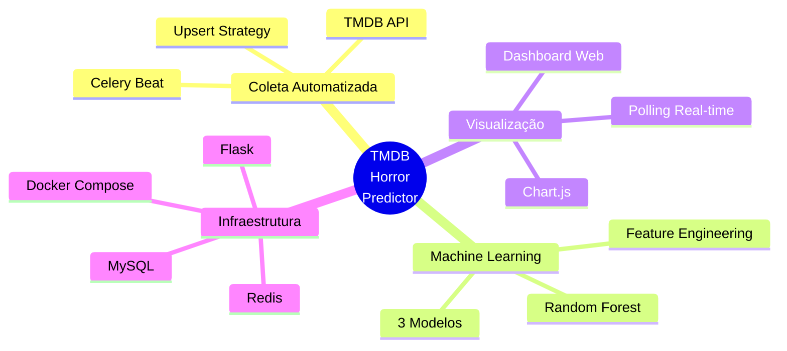

**Principais Conquistas:**
1. ✅ Sistema 100% automatizado
2. ✅ Dados sempre atualizados
3. ✅ Modelos re-treinados periodicamente
4. ✅ Insights visuais e acionáveis
5. ✅ Arquitetura escalável e manutenível

**Aplicações Reais:**
- 🎬 Produtoras de cinema
- 📺 Plataformas de streaming
- 💰 Investidores de entretenimento
- 📊 Analistas de mercado
- 🎓 Pesquisadores acadêmicos

---

**Desenvolvido com ❤️ para aprender e aplicar:**
- Data Engineering
- Machine Learning
- DevOps
- Software Architecture
- Python Ecosystem


